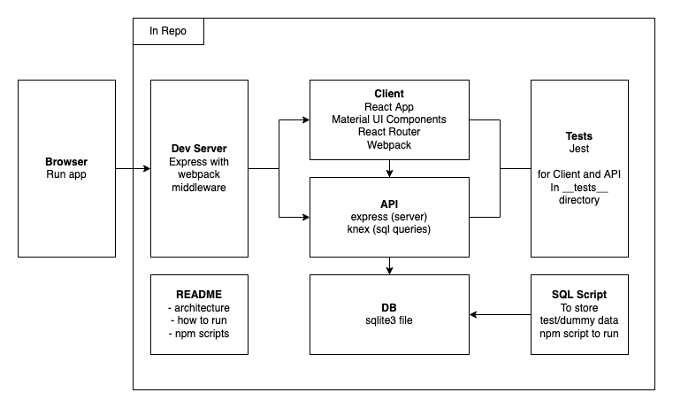

# News Labs I/O

## Requirements
This has been tested using Node.js 16 on macOS 11.

### Before the interview
- Ensure you have a working Node.js environment
- Install dependencies: `npm install`
- The tests should all pass: `npm test`
- The application should run: `npm start`
- You should be able to open the application in the browser: http://localhost:8080
- The "Submissions" tab should show three submissions like the following screenshot:

- Note there is no Hot Module Reload - when editing the client app, webpack will recompile on save, but in order to see the changes in the browser, a manual reload is required.

If you get stuck with any of the above, please reach out to [coding-exercises@bbcnewslabs.co.uk](mailto:coding-exercises@bbcnewslabs.co.uk) with the position you're applying for and the issue you're having.
In interview, we want to use your machine.  We will be using Zoom and the screen share functionality, which works best with the app installed. Please get in touch if that is not possible.
Please familiarise yourself with a drawing tool to touch on architecture diagram during the interview. Popular and free online ones are excalidraw, draw.io or Google Draw (the latter requires a Google Account).

## Used Libraries
### Serverside
- [express](https://www.npmjs.com/package/express)
- [knex](https://www.npmjs.com/package/knex) with [sqlite3](https://www.npmjs.com/package/sqlite3)

### Clientside
- [react](https://www.npmjs.com/package/react) 17
- [react-router](https://www.npmjs.com/package/react-router-dom) 
- [mui](https://mui.com/) (Material UI)

### Supporting
- [jest](https://jestjs.io/) for tests (running, mocking, asserting)
- [supertest](https://www.npmjs.com/package/supertest) for backend tests (environment for server-side app)
- [enzyme](https://www.npmjs.com/package/enzyme) 3 for frontend tests (renders react components)
- [webpack](https://webpack.js.org/) for bundling react
- [eslint](https://www.npmjs.com/package/eslint) for linting

## App Structure

### Client

The source code for this is in the `src/client` directory.

This app includes a stand-alone react-based client application, written in TypeScript.
This application is built by webpack and ts-loader _only_, and does not make use of babel.

The webpack config also creates an index.html to load the react application.

### API

The source code for this is in the `src/api` directory.

This app includes a stand-alone express-based API server application, written in TypeScript

### Scripts
#### start
The `npm start` script launches the `./src/server.ts` file, with the webpack middleware, and including the API express app.

On `/` it serves the index.html creared by webpack to load the client react application.
It also serves other routes as defined by the API express app.

There is no hot module reloading or anything like that in the browser.

#### build
The `npm build` script runs two commands:
- webpack: To build the client application. This will be output into `dist/client`.
- tsc: To build the server-side application. This will be output into `dist/api`.

Note that webpack uses a different tsconfig file than tsc does.

#### test
The `npm test` script runs one command:
- jest: To run the unit tests for the backend and frontend applications