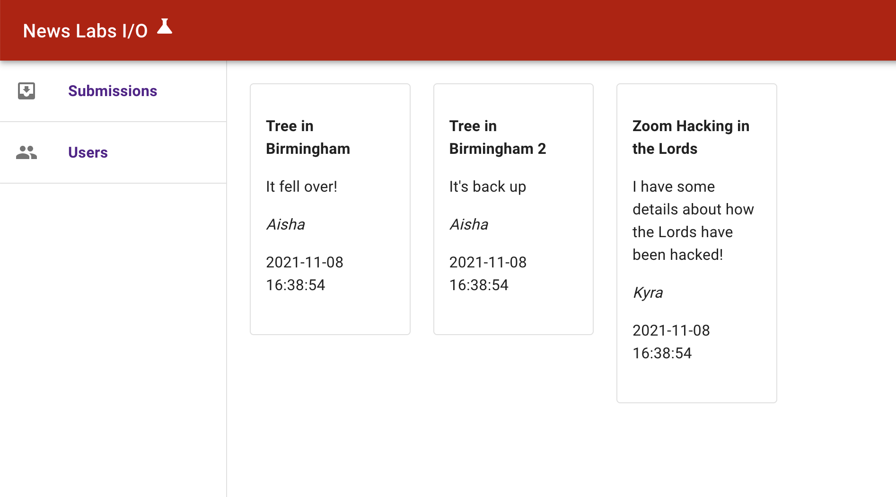

# News Labs I/O

A News Labs application prototype to be used during code interviews.

The idea of this application is to allow the public to submit tips to the BBC in a secure manner and for journalists to manage the incoming tips and react to them.

The client is written in Typescript/React and the API is available in either Python or Node/Typescript. You can choose the API which best suits your skills.

## Requirements

The JavaScript has been tested using Node.js 16 and Python 3.9 on macOS 12 (Monterey).

### Before the interview

- Ensure you have a working Node.js (and Python if applicable) environment

For the JavaScript code (in `js/client` and `js/api`, if using):

- Install dependencies: `npm install`
- The tests should all pass: `npm test`
- The application should run: `npm start`

For the Python code (in `/python/api`):

- Create a virtual environment, e.g. `python3 -m venv nlio`
- Install the requirements: `pip install -r requirements.txt`
- Run the API server: `uvicorn main:app --port 8080`

Next:

- You should be able to open the application in the browser: http://localhost:3000
- The "Submissions" tab should show three submissions like the following screenshot:

If you get stuck with any of the above, please reach out to [coding-exercises@bbcnewslabs.co.uk](mailto:coding-exercises@bbcnewslabs.co.uk) with the position you're applying for and the issue you're having.

In interview, we want to use your machine. We will be using Zoom and the screen share functionality, which works best with the app installed. Please get in touch if that is not possible.

Please familiarise yourself with a drawing tool to touch on architecture diagram during the interview. Popular and free online ones are excalidraw, draw.io or Google Draw (the latter requires a Google Account).

## Used Libraries

### JS Server-side

- [express](https://www.npmjs.com/package/express)
- [knex](https://www.npmjs.com/package/knex) with [sqlite3](https://www.npmjs.com/package/sqlite3)

### Python Server-side

- [FastAPI](https://fastapi.tiangolo.com/)
- [Pydantic](https://pydantic-docs.helpmanual.io/)
- [uvicorn](https://www.uvicorn.org/)
- [sqlite3](https://docs.python.org/3/library/sqlite3.html) (standard library)

### Client-side

- [react](https://www.npmjs.com/package/react) 17
- [react-router](https://www.npmjs.com/package/react-router-dom) 
- [mui](https://mui.com/) (Material UI)

### JS Supporting

- [jest](https://jestjs.io/) for tests (running, mocking, asserting)
- [supertest](https://www.npmjs.com/package/supertest) for backend tests (environment for server-side app)
- [enzyme](https://www.npmjs.com/package/enzyme) 3 for frontend tests (renders react components)
- [webpack](https://webpack.js.org/) for bundling react
- [eslint](https://www.npmjs.com/package/eslint) for linting

### Client

The source code for this is in the `js/client` directory.

This app includes a stand-alone react-based client application, written in TypeScript.

This application is built by webpack and ts-loader _only_, and does not make use of babel.

The webpack config also creates an `index.html` to load the react application.

#### start

The `npm start` script launches the client on http://localhost:3000.

#### build

The `npm run build` script runs tsc to build the client application. This will be output into `/dist`.

#### test

The `npm test` script runs jest for the unit tests.

### JavaScript API

The source code for this is in the `js/api` directory.

This app includes a stand-alone express-based API server application, written in TypeScript.

#### start

The `npm prestart` script will execute first, which initialises the development database (in `/sql/dev.db`).

The `npm start` script launches the `./src/server.ts` file, with the API express app on http://localhost:8080.

#### build

The `npm run build` script runs `tsc` to build the server-side application. This will be output into `/dist`.

#### test

The `npm pretest` script will execute first, which initialises the development database (in `/sql/dev.db`).

The `npm test` script runs jest for the unit tests.

### Python API

The source code for this is in the `python/api` directory.

This app includes a stand-alone FastAPI-based API server application.

#### start

Start the server with `uvicorn main:app --port 8080`